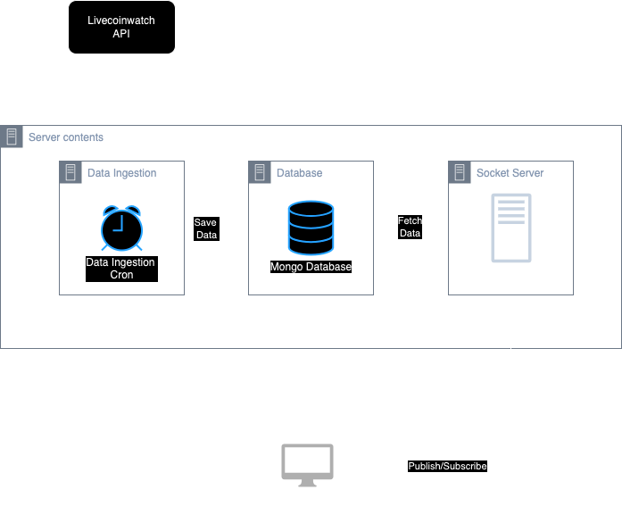

# FomoFactory

## Installation Guide

### Docker

If Docker is installed on your system, then all you need to do is run the following command.

```bash
docker compose up
```

Then open `http://localhost:3000/` on your browser

If you have made any changes in the source code then you will need to rebuild using the following command

```bash
docker compose up --build
```

### Without docker

**Prequisites**  

- You need to have [Mongodb Community Edition](https://www.mongodb.com/products/self-managed/community-edition) installed on your system preferably version 6 or above.  
- If that is not possible then you need to use the online version of Mongodb, More info here [MongoDB online](https://www.mongodb.com/resources/products/platform/online).  
- Generate a database connection string and paste it into the `.env` file.

Example string

```
mongodb+srv://<username>:<password>@<clusterName>.abcdef.mongodb.net/?retryWrites=true&w=majority&appName=<appName>
```

**Backend**

- Navigate to the server folder
- Create a .env file and copy contents from .env.template file
- Assign the MongoDB URI connection string to `MONGO_DB_URL` in the `.env` file.
- If MongoDB is installed locally then use `mongodb://localhost:27017`
- Run `npm install`
- Start the server using `npm start`
- Alternatively run `npm run dev` to start in development mode.

**Frontend**

- Navigate to the app folder.
- Run `npm install`
- Start app in development mode by running `npm run dev`.
- Open <http://localhost:3000/> on browser

## Architecture



### Database

I have chosen to use MongoDB version 7 as the database for storing time series data. To achieve this, I utilized the "[TimeSeries](https://www.mongodb.com/docs/manual/core/timeseries-collections/)" collection type, which offers several advantages over a standard collection. According to the documentation, time series collections offers the following benefits:

- Reduced complexity for working with time series data
- Improved query efficiency
- Reduced disk usage
- Reduced I/O for read operations
- Increased WiredTiger cache usage

This is important as we will be continuosly reading data for multiple users.

### Data Ingestion

I used node-cron to schedule a data fetching job. It fetches live data from [Livecoinwatch api](https://www.livecoinwatch.com/tools/api) and saves it in MongoDB every few seconds. The rate can be controlled by `DATA_INGESTION_INTERVAL_SECONDS` parameter in the env file.

### Backend

**SocketIO**

Used for sending data to frontend apps in real time.

### Frontend

NextJS along with Socket IO client and Redux was used. Upon launching the app, the socket is connected and price events are subscribed to.  
Note that I could not save the redux store into local storage because of syncing-related issue with real-time data.

## Video

[](http://www.youtube.com/watch?v=wlO8saqj_J8 "App Working Video")

## Screenshots


