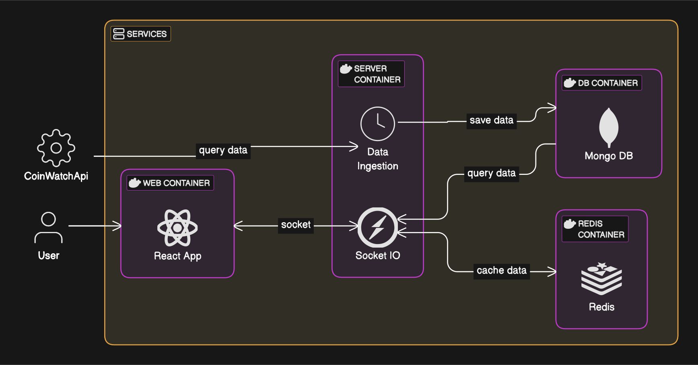
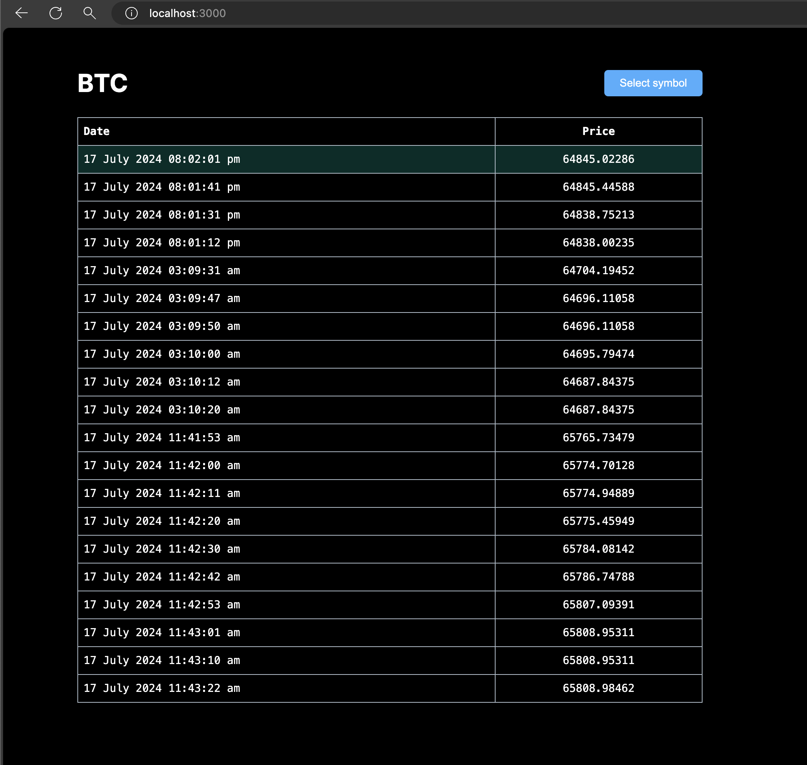
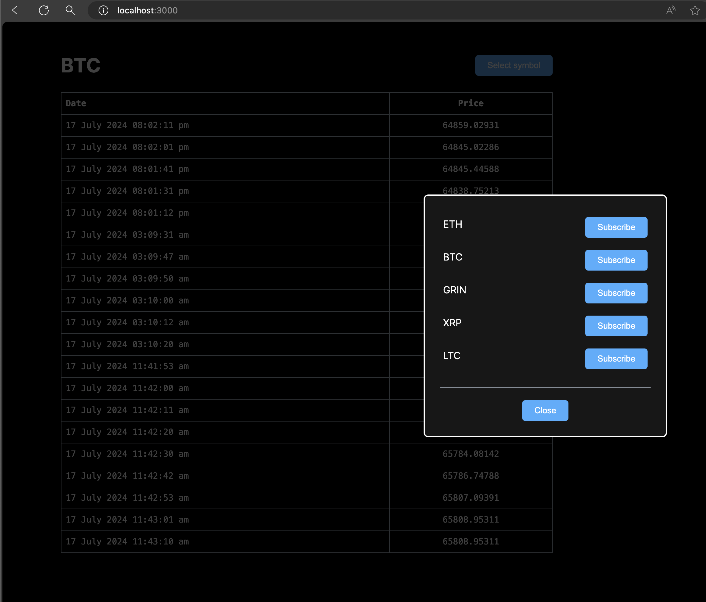
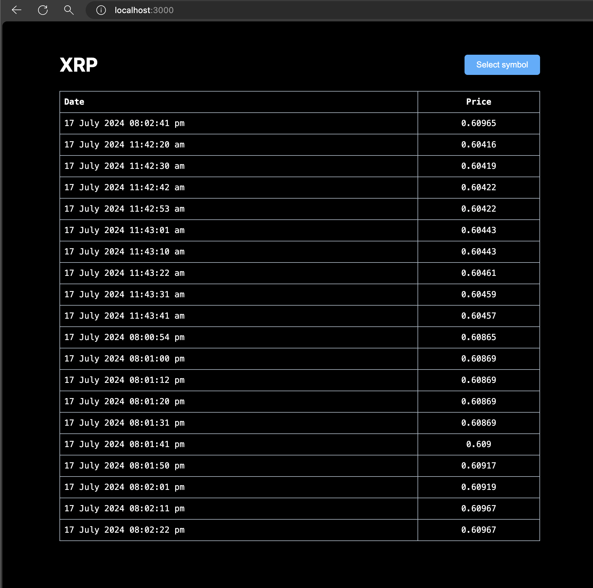
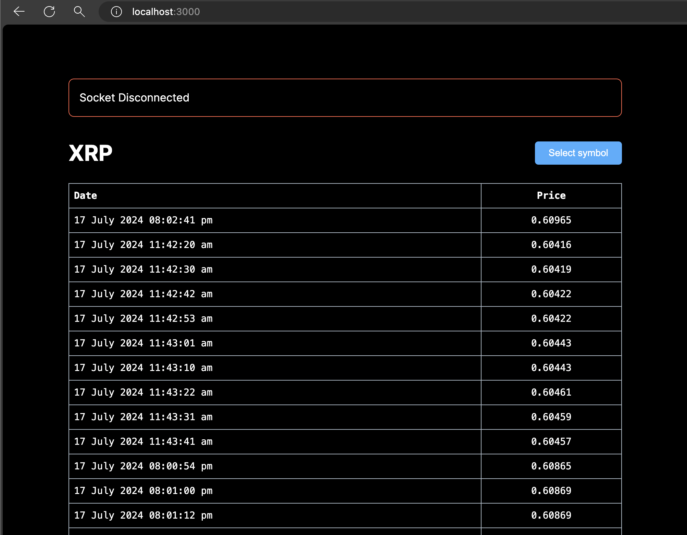

# Fullstack Docker Multi Container App

This is a full stack application that fetches live cryptocurrency data from [Livecoinwatch api](https://www.livecoinwatch.com/tools/api) and displays it in real time. The app is built using the MERN stack and uses Docker for containerization.

This app showcases how to use multiple containers in a single application. The app consists of the following containers:

- **Frontend** - A NextJS app that displays the live data.
- **Backend** - A NodeJS app that fetches live data from the api and saves it in MongoDB.
- **Database** - A MongoDB database that stores the live data.
- **Cache** - A Redis cache that stores the live data for faster access.

The frontend app uses SocketIO to receive real-time data from the backend app. The backend app fetches live data from the api every few seconds and saves it in the MongoDB database.

All the containers are orchestrated using Docker Compose. Refer to the [docker-compose.yml](./docker-compose.yml) file for more details.

## Architecture



### Database

I have chosen to use MongoDB version 7 as the database for storing time series data. To achieve this, I utilized the "[TimeSeries](https://www.mongodb.com/docs/manual/core/timeseries-collections/)" collection type, which offers several advantages over a standard collection. According to the documentation, time series collections offers the following benefits:

- Reduced complexity for working with time series data
- Improved query efficiency
- Reduced disk usage
- Reduced I/O for read operations
- Increased WiredTiger cache usage

This is important as we will be continuosly reading data for multiple users.

### Data Ingestion

I used node-cron to schedule a data fetching job. It fetches live data from [Livecoinwatch api](https://www.livecoinwatch.com/tools/api) and saves it in MongoDB every few seconds. The rate can be controlled by `DATA_INGESTION_INTERVAL_SECONDS` parameter in the env file.

### Backend

**SocketIO**

Used for sending data to frontend apps in real time.

**Redis**

Used as a cache to store the live data. This is used to reduce the load on the database.

### Frontend

NextJS along with Socket IO client and Redux was used. Upon launching the app, the socket is connected and price events are subscribed to.  

## Installation Guide

### Env Setup

- Create a account on [Livecoinwatch](https://www.livecoinwatch.com/tools/api) and get an api key.
- Create a `.env` file in the server folder and copy the contents from `.env.template` file. Fill in the values for the environment variables.
- Place one copy in root folder and another in server folder.

```bash
MONGO_DB_URL=mongodb://mongo_db:27017/fullstack_docker
PORT=8080
DATABASE_NAME=fullstack_docker
COIN_API_KEY="Put your api key here"
DATA_INGESTION_INTERVAL_SECONDS=10
NEXT_PUBLIC_API_URL=http://server:8080
```

### Docker

If Docker is installed on your system, then all you need to do is run the following command.

```bash
docker compose up
```

Then open `http://localhost:3000/` on your browser

If you have made any changes in the source code then you will need to rebuild using the following command

```bash
docker compose up --build
```

### Without docker

**Prequisites**  

- You need to have [Mongodb Community Edition](https://www.mongodb.com/products/self-managed/community-edition) installed on your system preferably version 6 or above.  
- If that is not possible then you need to use the online version of Mongodb, More info here [MongoDB online](https://www.mongodb.com/resources/products/platform/online).  
- Generate a database connection string and paste it into the `.env` file.

> If you are using online version you will need to add your IP address in the "Network Access" section of the MongoDB dashboard. If this step is not done, you will get error.

Example string

```
mongodb+srv://<username>:<password>@<clusterName>.abcdef.mongodb.net/?retryWrites=true&w=majority&appName=<appName>
```

**Backend**

- Navigate to the server folder
- Create a .env file and copy contents from .env.template file
- Assign the MongoDB URI connection string to `MONGO_DB_URL` in the `.env` file.
- If MongoDB is installed locally then use `mongodb://localhost:27017`
- Run `npm install`
- Start the server using `npm start`
- Alternatively run `npm run dev` to start in development mode.

**Frontend**

- Navigate to the app folder.
- Run `npm install`
- Start app in development mode by running `npm run dev`.
- Open <http://localhost:3000/> on browser

## Video

[](http://www.youtube.com/watch?v=wlO8saqj_J8 "App Working Video")

## Screenshots





